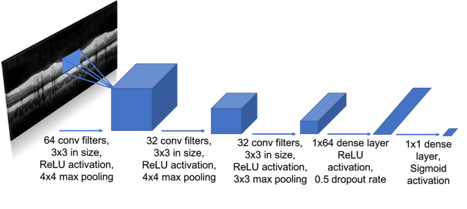
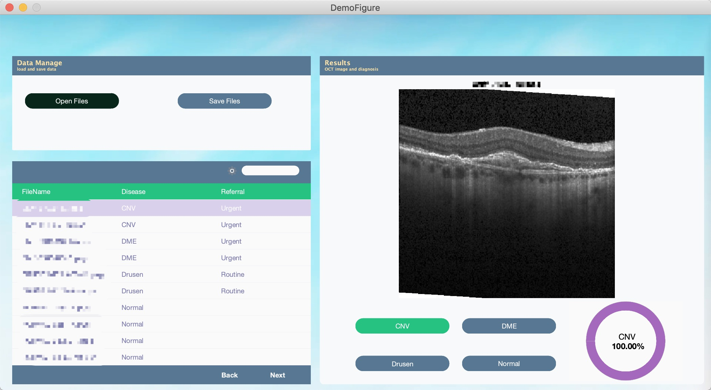

# OllieOCT
## A demo of automatic ophthalmologist assistant 

Ollie is a demo software tool to detect eye diseases accurately and efficiently using deep learning models

The diagnose is based on a pre-trained deep learning model with >90% accuracy. 

  

  

## Reference
1. AJ Geiger (2020). Build a Modern Dashboard Today (https://www.mathworks.com/matlabcentral/fileexchange/65073-build-a-modern-dashboard-today), MATLAB Central File Exchange. Retrieved July 31, 2020.
